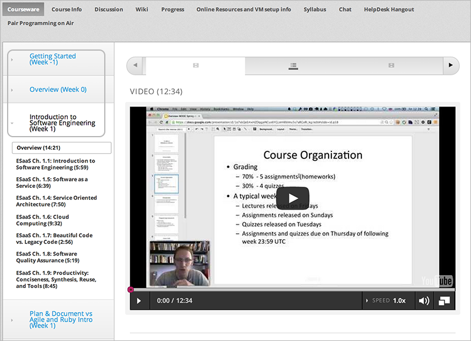

.. _Course Sections:

###################################
Course Sections
###################################

* `What is a Section?`_
* `Viewing Sections in the Outline`_
* `The Student View of a Section`_
* `Section States`_
* `Section States and Visibility to Students`_
* `Create a Section`_
* `Edit a Section`_
* `Set the Release Date for a Section`_
* `Hide a Section from Students`_
* `Delete a Section`_

****************************
What is a Section?
****************************

A section is the topmost category in your course. A section can represent a
time period in your course, a chapter, or another organizing principle. A
section contains one or more subsections.

********************************
Viewing Sections in the Outline
********************************

TBP

******************************
The Student View of a Section
******************************

Students see sections in the Courseware tab, at the top level of the left-hand
navigation tree. Students can expand one section at a time to see its contents.
In the following example, two sections are circled:

************************************************
Section States
************************************************

As an course author, you work with sections in the following states:

* `Draft: Unscheduled`_
* `Scheduled`_
* `Released`_
* `Released with Unpublished Changes`_
* `Hidden from Students`_

========================
Draft: Unscheduled
========================

When you create a section, it does not have a scheduled release date.
Regardless of the state of content within the section, the entire section is
not visible to students.

The following example shows how an section in the Draft: Unscheduled state is
displayed in the outline:

TBP

To make the content available to students, you must schedule the release date.

==========
Scheduled
==========

A section that is scheduled for release on a future date is not visible to
students. Regardless of the state of content within the section, the entire
section is not visible to students.

The following example shows how an section in the Scheduled state is displayed
in the outline:

TBP

The scheduled date must pass for the section to be visible to students.

===========================
Released
===========================

A section that is released is visible to students; however students see only
subsections within the section that are also released, and units that are
Published.

The following example shows how an section in the Released state is displayed
in the outline:

TBP

==================================
Released with Unpublished Changes
==================================

If you change a unit in a published section, the section state becomes Released
with Unpublished Changes.  Students view the last published copy of content in
the section.

The following example shows how an section that is hidden from students is
displayed in the outline:

TBP

You must publish changes for students to see the content updates.

===========================
Hidden from Students
===========================

A section that is hidden from students is not available, regardless of the
release date of any subsections or published state of any units.

The following example shows how an section that is hidden from students is
displayed in the outline:

TBP

************************************************
Section States and Visibility to Students
************************************************

Students never see a section that has an unscheduled or future release date.

If the release date of the section has passed, students see content in the
section if the section was not hidden from students. LINK TO HIDE FROM STUDENTS
TASK

For sections that are not hidden from students and past the release date,
students can see content; however, students do not necessarily see all content
in the section. Students may not see content in:

* A subsection, if its release date is not set or in the future, or if the
  subsection is hidden from students.
  
* A unit, if it was never published, or if it is hidden from students.

****************************
Create a Section
****************************

TBP

****************************
Edit a Section
****************************

TBP

***********************************
Set the Release Date for a Section
***********************************

TBP

***********************************
Hide a Section from Students
***********************************

TBP

****************************
Delete a Section
****************************

TBP