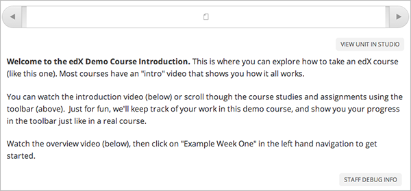

.. _Developing Course Units:

###################################
Developing Course Units
###################################

When working with units in the course outline, ensure you understand the
following:

* `What is a Unit?`_
* `Viewing Units in the Outline`_
* `Viewing Units as a Student`_
* `Unit States`_
* `The Unit User Interface`_

Unit tasks:

* `Create a Unit`_
* `Preview a Unit`_
* `Reorganize Units`_
* `Hide a Unit from Students`_
* `Publish a Unit`_
* `View a Published Unit`_
* `Delete a Unit`_

You add content to units with :ref:`course components<Developing Course
Components>`.

.. _What is a Unit?:

****************************
What is a Unit?
****************************

A unit is a part of a subsection. A subsection contains one or more units.
Subsections are divided into units. A unit, in turn, contains one or more
components, such as HTML content, problems, discussions, and videos.

****************************
Viewing Units in the Outline
****************************

TBP

****************************
Viewing Units as a Student 
****************************

To a student using the edX Learning Management System, each unit in the
subsection appears as a link on the course ribbon at the top of the page. The
following image shows a subsection that has seven units, which are circled in the ribbon above the video:

.. image:: ../Images/Units_LMS.png
 :alt: Image of units from the student's point of view

.. _The Unit Workflow:

************************************************
The Unit Workflow
************************************************

When you have set up the section and subsection in the course outline, you work
with units.

The typical workflow is:

#. Create a new unit.
#. Add components to the unit.
#. Publish the unit.
   
After you publish the unit, you can:

#. Modify components in the unit.
#. Publish the changes to the unit.
   
ADD WORKFLOW IMAGE
   
As you work through these steps, the **state** of the unit changes. The unit
state controls the content available to students. See the next section for more
information.

.. _Unit States:

************************************************
Unit States
************************************************

As an course author, you work with units in the following states:

* `Draft (Never Published)`_
* `Published`_
* `Draft (Unpublished Changes)`_

========================
Draft (Never Published)
========================

When you create a new unit and add components to it, the unit is in the state
**Draft (Never Published)**, as shown in the right panel:

IMAGE

The unit does not appear in the ribbon for the subsection in the LMS. Students
do not see a Draft (Never Published) unit. Though you do not see the unit in
the LMS, you can preview the unit LINK.

You must publish the unit (ADD LINK) for it to be included in the LMS.

==========
Published
==========

When you publish a unit, the unit is in the state **Published**, as shown in
the right panel:

IMAGE

The unit may or may not be visible to students, depending on the release date
and whether or not you chose to hide the unit from students. For more
information, see LINK

===========================
Draft (Unpublished Changes)
===========================

When you edit a published unit, its state changes to **Draft (Unpublished
Changes)**, as shown in the right panel:

IMAGE

The unit as shown in the LMS does not contain your changes until you publish
them; the LMS shows the last published version of the unit.

.. _Unit States and Visibility to Students:

************************************************
Unit States and Visibility to Students
************************************************

Students never see a unit that is in the state Draft (Never Published).

If the state is Published or Draft (Unpublished Changes), students see the last
published version of the unit if the following conditions are met:

* The release date for the containing section and subsection has passed. LINK
  TO RELEASE DATES.

* The unit was was not hidden from students. LINK TO HIDE FROM STUDENTS TASK

.. _The Unit User Interface:

************************************************
The Unit User Interface
************************************************

==============
Release Dates
==============

===========
Icons
===========

===========
Colors
===========

.. _Create a Unit:

****************************
Create a Unit
****************************

To create a new unit from the outline:

#. In the outline, expand the subsection in which you want to create a new
   unit.
#. Click **New Unit** at the bottom of the expanded subsection. A new
   unit is added at the end of the subsection.
#. Click the unit name to open the new unit.
#. On the unit page, click the Edit icon next to the new unit name, then enter
   the name for the new unit. Remember that students see the unit name in the
   coursware.
#. :ref:`Add components<Add a Component>` to the new unit as needed.

To create a new unit from a unit page:

#. In the **Unit Location** panel, click **New Unit**.

   .. image:: ../Images/unit_location.png
    :alt: The Unit Location panel in the Unit page

   The unit page for the new unit opens automatically.

#. On the unit page, click the Edit icon next to the new unit name, then enter
   the name for the new unit. Remember that students see the unit name in the
   coursware.
#. :ref:`Add components<Add a Component>` to the new unit as needed.

****************************
Preview a Unit
****************************

You preview a unit to review and test the content before it is visible to
students.

You can preview a unit before it is published and when there are unpublished
changes. When the unit is published and there are no pending changes, you
cannot preview the unit; you must view the live version of the unit.

When you are revising a previously published unit, it is helpful to preview
your changes in one window and :ref:`view the published unit<View a Published Unit>` in a second window and
compare the content.

To preview the unit, in the unit page, click **Preview Changes**.

The unit opens in preview mode:

.. _Reorganize Units:

************************************************
Reorganize Units
************************************************

****************************
Hide a Unit from Students
****************************

.. _Publish a Unit:

****************************
Publish a Unit
****************************

.. _View a Published Unit:

****************************
View a Published Unit
****************************

********************************
Delete a Unit
********************************

